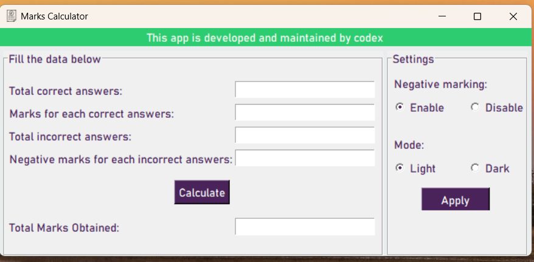
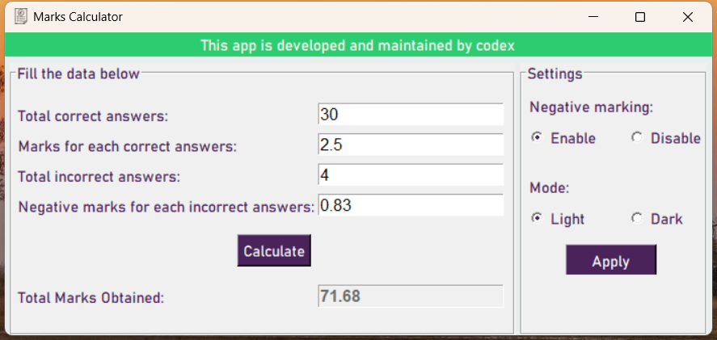
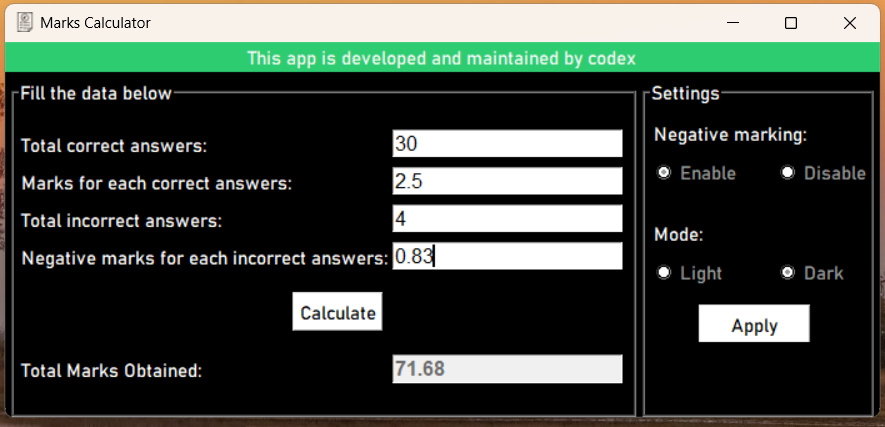
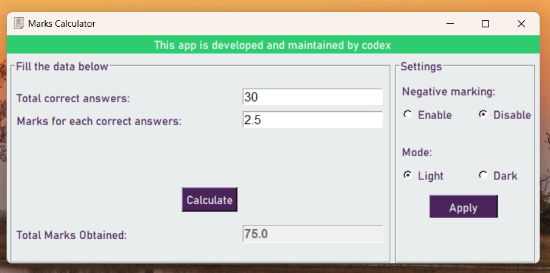

# marks-calculator

 
<p1>This is GUI based marks calculator.It makes you easier to calculate your marks.

 <b>Version(GUI UPDATE.CONTENT UPDATE.ERROR UPDATE):-</b>0.0.0
 

Some Screen  Shots

1.App View
 
 

1.Calculation View
 
 

1.Dark View
 
 

1.Negative marking disable View
 
 

